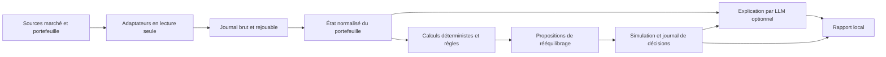

# Architecture de crypto-ia

État de référence : 11 septembre 2026. Ce document distingue le socle initial du système cible décrit dans le plan fourni.

## État de l'initialisation

Le socle est une CLI locale en Bun et TypeScript. Elle valide sa configuration et affiche son état `shadow`, avec les connecteurs désactivés. À ce stade, `shadow` désigne une restriction de fonctionnement ; la boucle d'observation et de simulation reste à construire.

| Capacité | État dans crypto-ia |
| --- | --- |
| Configuration locale et affichage de l'état | Socle initial |
| Ingestion de marché ou de portefeuille | À développer |
| Calcul de positions, PnL et risque | À développer |
| Simulation de rééquilibrage et journal de décisions | À développer |
| Appels LLM locaux ou cloud | Aucun connecteur actif |
| NATS, factory et cortex | Aucune connexion ni installation |
| UI, service permanent et ordres réels | Hors initialisation |

Le projet ne reprend pas l'application SaaS de `roxabi-original`. Ce dépôt local sert de référence pour les conventions Bun, TypeScript, Biome et le cycle de développement. `roxabi-plugins` fournit les workflows d'ingénierie ; il ne fournit pas les agents métier de portefeuille. Les révisions consultées figurent dans les [références](../references.md).

## Périmètre du premier produit utilisable

La première boucle complète vise un exchange, un compte spot et deux fonctions : surveillance des écarts et proposition de rééquilibrage simulée. Le choix précis de l'exchange et des actifs sera fixé dans sa spécification. Binance reste un exemple du plan, pas un connecteur installé.

La première démonstration utilise des données synthétiques rejouables. L'ingestion en lecture seule vient ensuite, avec séparation entre les données brutes, l'état normalisé et les résultats calculés. Les chiffres de performance d'un portefeuille ne doivent jamais être inventés par un LLM.

## Organisation cible

Le découpage privilégie les capacités métier. Chaque fournisseur est un adaptateur d'une interface étroite : source de marché, source de portefeuille, journal, moteur de langage ou bus. L'exchange et le fournisseur LLM ne deviennent pas des copies du moteur métier. L'ADR axial précise cette décision dans le [répertoire des ADR](adr/).

Ce diagramme décrit la cible ; ces composants ne sont pas encore implémentés. Un adaptateur factory/NATS pourra déclencher les mêmes cas d'usage que la CLI. Il ne déplacera pas les règles métier dans le transport.

| Capacité cible | Responsabilité | Frontière |
| --- | --- | --- |
| Ingestion | Lire, horodater et normaliser les données | Conserver source, identifiant et moment d'observation |
| Portefeuille | Produire positions et valorisation depuis un état cohérent | Montants représentés en décimal exact ou unités entières explicites |
| Risque | Appliquer des limites définies et versionnées | Refuser les entrées périmées ou incomplètes |
| Simulation | Comparer allocation actuelle et cible, estimer frais et écarts | Résultats étiquetés comme simulés |
| Explication | Décrire les données et résultats calculés | Aucun pouvoir d'ordre, aucun secret dans le contexte |
| Journal | Relier données, version des règles et résultats | Rejeu déterministe, détection des doublons |
| Adaptateurs | Traduire les protocoles externes | Aucune décision d'allocation dans les connecteurs |

## Place de Roxabi

`roxabi-factory` constitue une piste d'orchestration. Son README décrit un hub Python/asyncio, des échanges NATS orientés conversations et des workers, avec Claude CLI comme moteur principal. Le contrat de déclenchement des jobs de portefeuille doit donc être étudié et testé ; ce n'est pas une intégration acquise. [README factory, révision consultée](https://github.com/Roxabi/roxabi-factory/blob/da99f561d268331ba0ee7134ebd7d187e7c34f25/README.md).

`roxabi-cortex` décrit une architecture de capture et de mémoire d'agents. Le README consulté indique que l'implémentation n'a pas commencé. Le journal comptable et l'état de portefeuille doivent rester sous la responsabilité de crypto-ia ; un export vers cortex sera évalué quand un contrat exécutable et versionné sera disponible. [README cortex, révision consultée](https://github.com/Roxabi/roxabi-cortex/blob/ddac29c50dc0d730056eec672979e4bc67c54724/README.md).

`llmCLI` documente une API HTTP compatible avec OpenAI et des moteurs locaux, mais ses procédures de service reposent sur Podman, Quadlet et systemd. Une preuve de fonctionnement sur l'environnement retenu est requise avant son intégration. Aucun débit, budget de contexte ou remplissage de VRAM n'est garanti pour la RTX 3070 mentionnée dans le plan. [README llmCLI, révision consultée](https://github.com/Roxabi/llmCLI/blob/4565e3b7f237966d259feed496dada2e10296425/README.md).

## Contrat d'événement envisagé

Avant un bus réseau, une enveloppe devra contenir `eventId`, `schemaVersion`, `observedAt`, `receivedAt`, `source`, un identifiant de compte opaque et une charge utile typée. Le format des montants, la devise de valorisation et la politique de données manquantes feront partie du contrat.

Les sujets du plan (`market.ticks.*`, `portfolio.balances.*`, `agents.decisions.*`) sont des propositions locales, sans compatibilité déclarée avec les contrats factory. Une intégration NATS devra définir persistance, acquittements, reprise, déduplication, ordre par compte et contrôle d'accès. Le journal rejouable restera nécessaire même avec un bus.

## Routage local et cloud

Le LLM est optionnel dans la première boucle. Son premier rôle sera de produire une explication à partir de résultats calculés. Une sortie structurée invalide, un délai dépassé ou l'absence du modèle doivent laisser disponibles la simulation et son rapport déterministe.

Le modèle local, sa quantification et son contexte seront choisis après mesure sur le matériel réel : mémoire maximale, latence, validité des sorties et qualité sur des cas synthétiques. Les modèles Qwen cités dans le plan sont des candidats à réévaluer, sans téléchargement effectué ni benchmark validé.

Un futur adaptateur Z.ai devra utiliser une offre d'API générale adaptée à l'application. Les quotas du Coding Plan ne sont pas une base pour un worker autonome de portefeuille : les conditions réservent leur usage aux outils officiellement supportés et excluent les appels directs d'applications hors accord écrit. [Conditions Z.ai, section 4, consultées le 11 septembre 2026](https://docs.z.ai/legal-agreement/subscription-terms).

Tout fournisseur cloud restera désactivé jusqu'à la définition d'un budget, d'un modèle disponible et d'un contrat de minimisation des données envoyées. Aucun compte cloud n'est configuré par cette initialisation.

## Limites à conserver dans les prochaines étapes

- Le mode initial ne possède pas de chemin d'exécution d'ordre réel.
- Les données externes et les textes de modèle sont des entrées non fiables ; les règles doivent être du code testable.
- Une clé de lecture ne doit jamais être transmise à un agent, un prompt ou un journal.
- Une panne, un état incomplet ou un prix périmé produit un état dégradé explicite, jamais une décision silencieusement présentée comme valide.
- Les notifications, services permanents, connexions privées et exécuteurs seront des étapes distinctes et explicites de la roadmap.

Voir la [roadmap](../roadmap.md) pour les critères de passage entre ces étapes.
